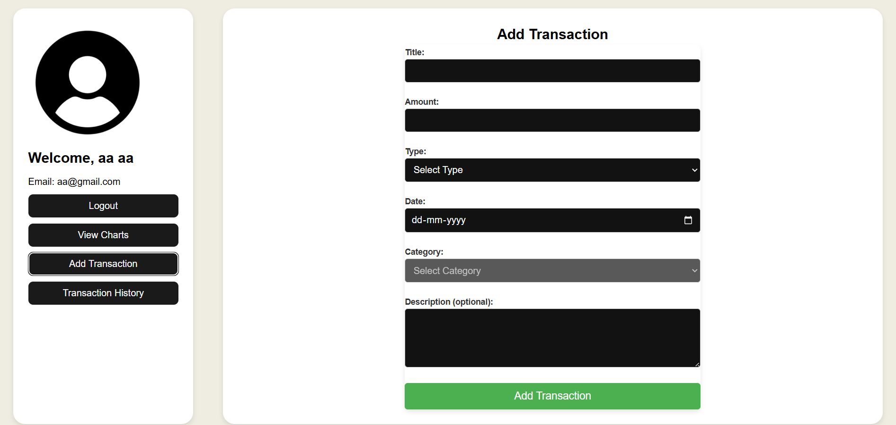
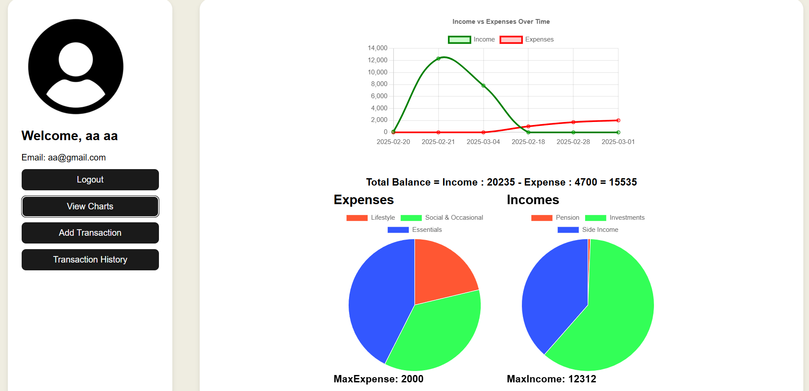
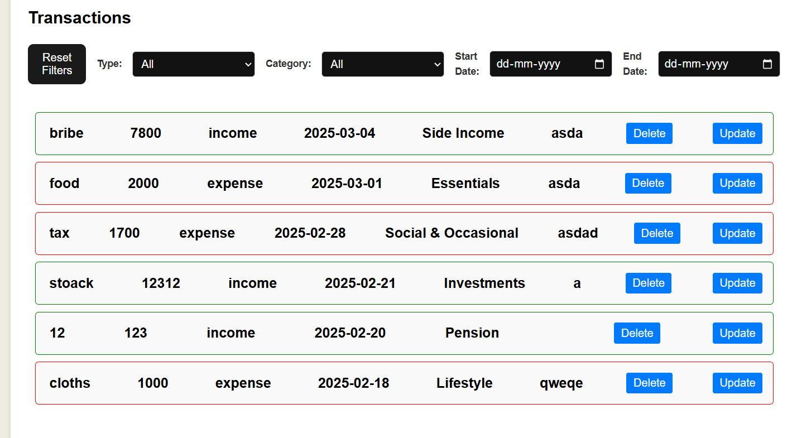
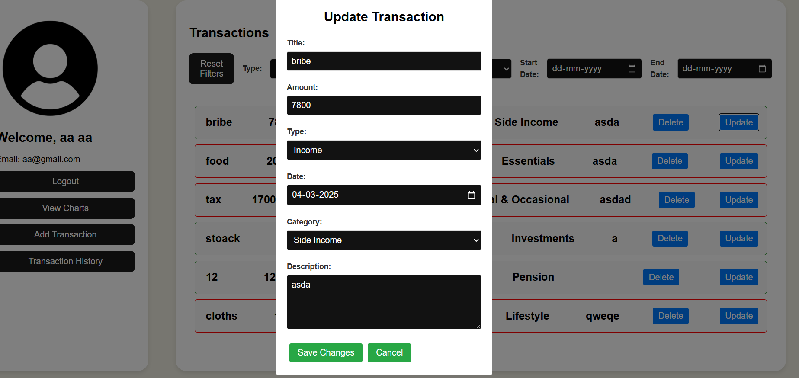

# JWT Authentication and Transaction Management System

## deploy link  http://43.204.14.238:5000/signup  (aws deployed)

## domain , https://mymoney.ritikraj.tech 
## Overview
This application implements JWT-based authentication and transaction management. Users can register, log in, and manage transactions (income and expenses). The frontend utilizes React for the user interface, Axios for API requests, and Chart.js for visualizing financial data.

## Table of Contents
- [JWT Authentication Workflow](#jwt-authentication-workflow)
- [Backend Routes and Functions](#backend-routes-and-functions)
- [Frontend Routes and Flow](#frontend-routes-and-flow)
- [Frontend Authentication and Error Handling](#frontend-authentication-and-error-handling)
- [Transaction Management Components](#transaction-management-components)
- [Technologies Used](#technologies-used)
- [Security Considerations](#security-considerations)

## JWT Authentication Workflow
1. **Token Generation**: On login/registration, the server generates a JWT containing essential user information and signs it with a secret key.
2. **Token Storage**: The JWT is stored in the browser's cookies for subsequent requests.
3. **Token Validation**: For every request requiring authentication, the token is validated. If valid, user information is extracted; if invalid/expired, an error is returned.
4. **JWT Middleware**: Middleware checks for the presence and validity of the token for protected routes.
5. **Token Expiry**: Tokens expire after a set time (e.g., 1 hour), requiring the user to log in again.
6. **Error Handling**: Common error responses include 401 Unauthorized and 403 Forbidden for invalid or expired tokens.

## Backend Routes and Functions
### User Routes
- **POST /signUp**: Register a new user.
- **POST /login**: Authenticate a user and issue a JWT token.
- **POST /logout**: Log out the user by clearing the JWT cookie.
- **GET /profile**: Fetch the authenticated user's profile (excluding password).

### Transaction Routes
- **POST /addTrans**: Add a new transaction for the authenticated user.
- **POST /getIncome**: Fetch and aggregate income transactions.
- **POST /getExpense**: Fetch and aggregate expense transactions.
- **POST /getTrans**: Retrieve all transactions for the user.
- **POST /delete**: Delete a specific transaction.
- **POST /updateTrans**: Update transaction details.

## Frontend Routes and Flow
### SignUp
- **Route**: `/signUp`
- **Flow**: User enters registration details. On success, redirects to the login page.

### Login
- **Route**: `/login`
- **Flow**: User provides credentials. On success, the JWT token is stored in an HTTP-only cookie, and the user is redirected to the dashboard.

### Profile
- **Route**: `/profile`
- **Flow**: Fetch and display user profile details.

### Logout
- **Route**: `/logout`
- **Flow**: Clears JWT cookie and redirects to the login page.

## Transaction Management
### Add Transaction
- **Route**: `/addTrans`
- **Flow**: User adds a transaction (income/expense). A POST request is made to save the transaction.

### View Transactions
- **Route**: `/getTrans`
- **Flow**: Displays all transactions. The user can filter by type (income/expense), category, and date range.

### View Income/Expense Transactions
- **Route**: `/getIncome` & `/getExpense`
- **Flow**: Fetches and displays only income or expense transactions.

### Delete Transaction
- **Route**: `/delete`
- **Flow**: Deletes the selected transaction upon confirmation.

### Update Transaction
- **Route**: `/updateTrans`
- **Flow**: Allows the user to edit transaction details.

## Frontend Authentication and Error Handling
- JWT tokens are automatically included in requests via HTTP-only cookies.
- Error messages are displayed for authentication failures or invalid requests.
- Client-side validations ensure proper data format (e.g., valid email, password strength).

## Transaction Management Components
### Transaction Component
- Manages the display, filtering, and management of transactions.
- Allows filtering by type, category, and date range.
- Uses `react-toastify` for success/error notifications.

### Transaction Item (Trans) Component
- Represents a single transaction.
- Allows updating and deleting a transaction.
- Displays a modal with pre-filled data for editing transactions.

## Technologies Used
- **Frontend**: React, Axios, React Toastify, Chart.js
- **Backend**: Node.js, Express.js, JWT
- **Authentication**: JWT-based, with tokens stored in HTTP-only cookies.
- **State Management**: React's `useState` and `useEffect` hooks.

## Security Considerations
- Use HTTPS for secure transmission of JWT tokens.
- Ensure strong secret keys for JWT signing and regularly rotate them.
- Set appropriate token expiration times to reduce security risks.

## Conclusion
This system offers a secure, scalable way to manage user authentication and transaction data with JWT, enabling smooth management of income and expenses. The frontend provides an intuitive interface for users to interact with their financial data while the backend securely handles authentication and data management.
